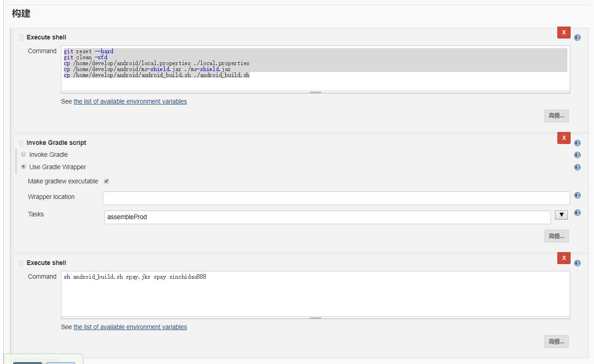

# Android jenkins自动上传
## (参考)[https://www.jianshu.com/p/9e20cdc9e9a0] 
> 前提是Jenkins已经安装好了 gitlab 也可以支持，对应的插件都有了

1. 安装Android插件【Android Emulator PluginAndroid Lint Plugin】
2. 根据自己的Gradle安装对应的版本
3. 在本地添加Android SDK路径，这里要注意，如果本地没有sdk会提醒没有license，我是直接通过官网下载的sdk-tools-linux工具直接更新
    1. 下载地址[https://developer.android.com/studio/?hl=zh-cn#downloads]，下载命令行工具
    2. 参考[https://www.jianshu.com/p/06f1a37de2a6]
    ```sh
    export PATH=$PATH:sdk路径/tools/bin
    sdkmanager "platforms;android-27"
    sdkmanager "build-tools;27.0.3"
    ```
## 乐固加固和签名
> 使用乐固加固，参考[https://cloud.tencent.com/developer/article/1193406][https://cloud.tencent.com/developer/article/1193408]
1. 
2. 命令
```sh
git reset --hard
git clean -xfd
cp /home/develop/android/local.properties ./local.properties
cp /home/develop/android/ms-shield.jar ./ms-shield.jar
cp /home/develop/android/android_build.sh ./android_build.sh
```
```sh
# sh android_build.sh spay.jks spay xinchidao888
#! /bin/bash
# 参数 签名文件（如spay.jks），签名密码，签名别名
apkName=./app/build/outputs/apk/prod/release/*.apk
fileName=$(basename $apkName .apk)
echo $fileName
signFile=$1
signAlias=$2
signPwd=$3
echo ${signFile}
echo ${signAlias}
echo ${signPwd}

java -Dfile.encoding=utf-8 -jar ms-shield.jar -sid AKIDzz4E3hkWfedVFTmrrqkU3R5kLsHWnSWv -skey RjqnaHoDoHZheQ1bSQErKdmnhRo8LOH1 -uploadPath $apkName -downloadPath ./apk
jarsigner -verbose -keystore ./app/${signFile} -storepass ${signPwd} -signedjar ./apk/${fileName}_sign.apk -digestalg SHA1 -sigalg MD5withRSA ./apk/${fileName}_legu.apk  ${signAlias}
rm -f ./apk/${fileName}_legu.apk
```

3. 上传fir，参考[http://blog.fir.im/jenkins/]
> 	IPA/APK Files (optional) 设置从跟路径开始，只要文件夹就可以了，如【/var/lib/jenkins/workspace/spay/apk】