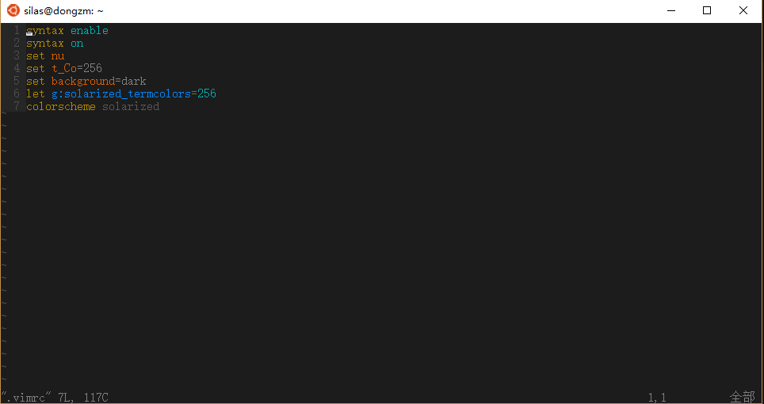

## 1、vim配色
> ubuntu window10 子系统，修改bash.exe的wim配色
* 使用Solarized配色方案
* [下载地址]('https://github.com/altercation/vim-colors-solarized/tree/master/colors') 下载git中的solarized.vim文件
* 放到当前用户的~/.vim/colors文件夹下，没有目录，需要新建
* 设置~/.vimrc，文件不存在就直接新建
```sh
#~/.vimrc
syntax enable
syntax on
set nu
set t_Co=256
set background=dark
let g:solarized_termcolors=256
colorscheme solarized
```
* 设置bash.exe的背景色RGL(28,28,28)
* 最后的颜色显示
> 跟官方提高的颜色还是相差很多，但是比自带的好看很多，网上查了很多资料讲的也不是很清楚。

## 2、ls的文件夹配色
> ubuntu下的/etc/目录里没有DIR_COLORS，这里使用dircolors命令，把命令中的内容重定向到用户目录中
```sh
cd ~
dircolors -p > .dircolors
vim ~/.dircolors
# 找到DIR 01;34=>DIR 01;35
```

## 3、修改终端路径显示
```
 PS1='${debian_chroot:+($debian_chroot)}\[\033[01;35;40m\]\u\[\033[00;00;40m\]@\[\033[01;35;40m\]\h\[\033[00;31;40m\]:\[\033[00;0    0;40m\]\W \[\033[01;32;40m\]\$ \[\033[01;36;40m\]'
```
* \W：只显示当前目录名，\w：显示全路径
* [参考]('http://blog.sina.com.cn/s/blog_6d0cbb0301019egu.html')
