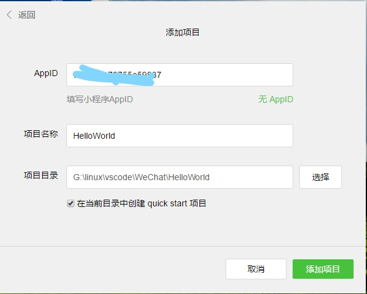
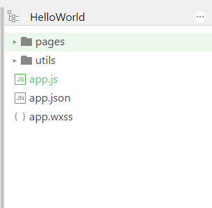

# 微信小程序介绍

## 1、小程序账号注册

* [注册地址]('https://mp.weixin.qq.com/cgi-bin/registermidpage?action=index&lang=zh_CN')

## 2、小程序 [入门教程]('https://mp.weixin.qq.com/debug/wxadoc/dev/')

1. [登录地址]('https://mp.weixin.qq.com/')
2. 登录后可以在首页下载开发者工具 [开发工具]('https://mp.weixin.qq.com/debug/wxadoc/dev/devtools/download.html?t=1499505079')
3. 根据自己的电脑版本下载对应的版本（windows64、windows32、mac）
4. 下载后双击.exe文件，按默认安装。
5. 自己注册的微信小程序，自己的账号就是管理员，可以直接用注册时绑定的微信号登录，管理员可以在**用户身份**页面绑定其它的开发者（5个）和体验者（10）
6. 登录后，填写对应信息，然后创建项目，AppID，在 设置>开发设置 下获取

7. 小程序项目的文档结构  

    * 其中.wxss 对应 .css样式表文件，是微信定义
    * app.js监听并处理小程序的生命周期函数、声明全局变量
    * app.json是对整个小程序的全局配置，我们可以在这个文件中配置小程序是由哪些页面组成，配置小程序的窗口背景色，配置导航条样式，配置默认标题。注意该文件不可添加任何注释
    * app.wxss 是整个小程序的公共样式表
8. [社区]('https://developers.weixin.qq.com/home?tab=1&labels=&lang=zh_CN&token=415767095')

## 3、第三方框架
1. [wepy]('https://wepyjs.github.io/wepy/#/')
2. [github资源汇总]('https://github.com/justjavac/awesome-wechat-weapp')
3. [github资源汇总]('https://github.com/opendigg/awesome-github-wechat-weapp')
4. [腾讯云]('https://www.qcloud.com/document/product/448/9570')
